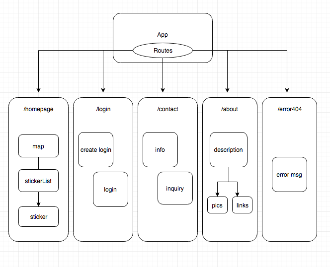

# stickUs

This repo contains material for planning an approach to creating my Capstone project.

By Kristi Hwang

## Description

####MVP
This website will be a platform to share status updates, specifically for a current location.  Users will see their exact location via Google Maps API to locate GPS coordinates.  This will allow the user to update the situation of that current area with the choice of stickers the site offers.  Stickers vary from: party, celeb, danger, construction, occasion, romance, pet to foodtruck.  After selecting their stickers and posting it to that location, it will show up on the site's map feature that updates in real time.  

There will also be a login feature for the user to keep track of their locations and sticker history.  User history will be organized by date, on a daily basis.  It will notify the user on which stickers are still "stuckOn" and which ones have expired.  Since stickers will have differing expiry, it will better UX to notify the user on their currently active stickers.  It will give the user an opportunity to re-evaluate the stickers and take them down if the situation is temporally no longer valid.  User accounts, and history of user sticker history will be backed up through Firebase.   

####Advanced Features
The action for posting stickers will be incentivized by allowing user to share to existing social media platforms like Facebook, Twitter, Instagram on individual accounts.  This website will have the flexibility to be used socially as well as for safety precautions depending on the sticker the user picks.

## Project Specs

In my final project:
* User will be able to get GPS coordinates for their current location via Google Maps API
* User will be able to choose appropriate stickers for their current situation
* User will be able to see the sticker they chose "stuck" on the site's map visual
* User will be able to create an account
* User will be able to login to StickUs and view their past sticker history on places they've been
* User will be able to share the posted status on their personal Facebook account via Facebook's share API
* User will be able to share the posted status on their personal Twitter account via Instagram's share API
* User will be able to take a picture and post that to their Instagram account

## Component Structure

## Setup & Installation

* Clone this Github repository
* Open up the cloned repository on your local device and navigate into your root folder
* Run "npm install" or "npm i"
* Run "npm run start"
* Load the page on http://localhost:8080/
* Enjoy the site and leave some feedback!

## Bugs

There are no known bugs to date.

## Support & Feedback

Any inquiries, comments, and/or concerns can be directed to Kristi Hwang via Github.

## Technologies Used

* React.js
* React-Redux
* Firebase
* JSX
* Google Maps API
* Bootstrap4.0
* CSS3
* HTML5

## Licensing

This project is licensed through the MIT open resource agreement.

Copyright(c) 2018 Kristi Hwang
